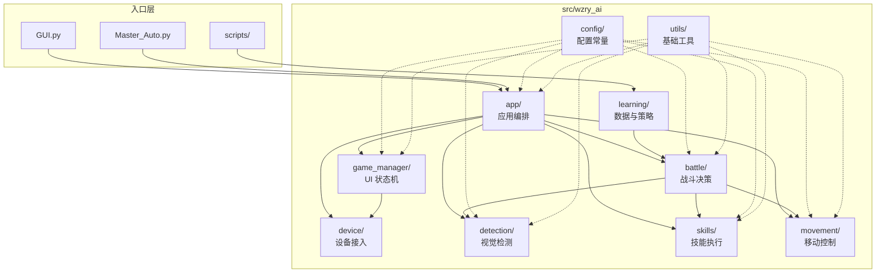
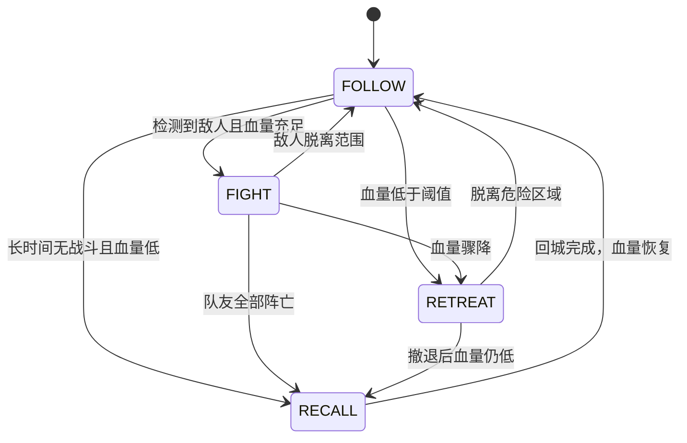
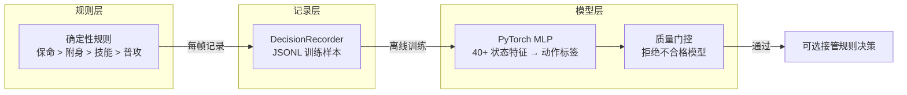
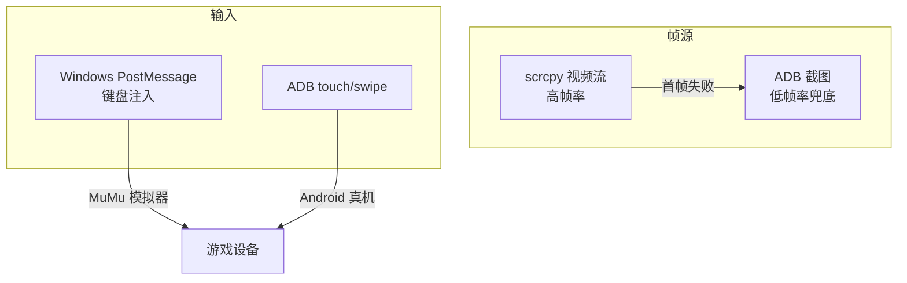

# WZ-Agent 架构说明

本文档描述项目的模块划分、运行时数据流和扩展边界，帮助开发者理解系统运作方式并判断改动应放在哪里。

---

## 模块总览



入口脚本保持薄封装，只做 `sys.path` 设置和函数调用。**全部业务逻辑必须放在 `src/wzry_ai/` 内**。

---

## 各模块职责

### app/ — 应用编排

| 文件 | 职责 |
|------|------|
| `bootstrap.py` | DPI 感知、H.264 stderr 过滤、ADB PATH 注入 |
| `services.py` | `GameServices`：设备初始化、帧源创建、线程启动与监控 |
| `game_loop.py` | 主循环：帧分发、小地图裁剪、调试窗口更新 |
| `loop_handlers.py` | 检测线程管理：model1/model2/state 三线程分发 |
| `orchestration.py` | 顶层 `main()`：bootstrap → services → loop |

### device/ — 设备接入

| 文件 | 职责 |
|------|------|
| `ADBTool.py` | ADB 命令封装（tap、swipe、screenshot、getevent） |
| `ScrcpyTool.py` | scrcpy 客户端封装 |
| `emulator_manager.py` | MuMu 模拟器窗口发现与 ADB 端口检测 |

### game_manager/ — UI 状态机

| 文件 | 职责 |
|------|------|
| `state_definitions.py` | `GameState` 枚举（25+ 种 UI 状态） |
| `state_detector.py` | 分层 + 深度模板匹配，确认去抖（连续 3 帧） |
| `template_matcher.py` | OpenCV 归一化互相关 + ROI 裁剪 |
| `click_executor.py` | ADB tap/swipe 命令发送 |
| `hero_selector.py` | 英雄优先级自动选择 |
| `popup_handler.py` | 未知状态弹窗处理 |

### detection/ — 视觉检测

| 文件 | 职责 |
|------|------|
| `model1_detector.py` | 小地图 YOLO：自身（绿）/友方（蓝）/敌方（红）定位 + 时间加权平滑 |
| `model2_detector.py` | 全屏 YOLO：血条检测 + HSV 颜色分析读取 HP% |
| `model3_detector.py` | 全屏 YOLO：击杀/塔攻击等游戏事件检测 |
| `modal_fusion.py` | Model1 + Model2 数据融合到统一坐标空间 |
| `pathfinding_optimized.py` | 优化 A* 寻路（通行代价 + 转弯惩罚） |
| `map_preprocessor.py` | 地图网格预处理（二值化 + 通行距离 + 骨架图） |

### battle/ — 战斗决策

| 文件 | 职责 |
|------|------|
| `world_state.py` | `WorldState` / `EntityState`：归一化游戏快照 |
| `threat_analyzer.py` | 基于敌人距离和数量计算威胁等级（SAFE/MEDIUM/HIGH） |
| `battle_fsm.py` | 四状态 FSM：FOLLOW → FIGHT → RETREAT → RECALL |
| `yao_decision_brain.py` | 瑶决策大脑：规则产生排序动作列表 |
| `target_selector.py` | 目标选择器 |
| `decision_recorder.py` | JSONL 决策记录 |
| `hero_registry.py` | 英雄 → 决策逻辑/技能逻辑的注册表 |

### skills/ — 技能执行

| 文件 | 职责 |
|------|------|
| `skill_base.py` | `SkillBase` ABC、`SkillConfig`、`SkillRegistry` |
| `caiwenji_skill_logic_v2.py` | 蔡文姬技能运行时 |
| `mingshiyin_skill_logic_v2.py` | 明世隐技能运行时 |
| `generic_skill_manager.py` | 通用技能管理（非瑶英雄） |

### movement/ — 移动控制

| 文件 | 职责 |
|------|------|
| `unified_movement.py` | 移动主逻辑：A* 路径跟随、8 方向键盘输出、`StuckDetector` |
| `base_follow_logic.py` | 跟随行为基类 |

### learning/ — 数据与策略

| 文件 | 职责 |
|------|------|
| `human_demo.py` | 人工示范采集（ADB getevent / Windows 键盘轮询） |
| `human_policy.py` | 策略模型加载、质量门检查、动作词表定义 |

---

## 运行时数据流

```mermaid
sequenceDiagram
    participant Loop as 主循环
    participant M1 as Model1 线程
    participant M2 as Model2 线程
    participant ST as State 线程
    participant BT as Battle 线程
    participant SK as Skill 线程

    Loop->>Loop: 获取帧, 裁剪小地图
    par 三路检测并行
        Loop->>M1: minimap_frame
        M1->>M1: YOLO 检测敌友位置
        M1->>BT: model1_data_queue

        Loop->>M2: full_frame
        M2->>M2: YOLO 检测血条 + HP%
        M2->>BT: model2_data_queue

        Loop->>ST: full_frame
        ST->>ST: 模板匹配 UI 状态
        ST->>ST: 自动点击（选人/确认等）
    end

    BT->>BT: WorldStateBuilder.build()
    BT->>BT: ThreatAnalyzer → 威胁等级
    BT->>BT: BattleFSM → 状态转换
    BT->>BT: DecisionBrain → 动作列表
    BT->>BT: UnifiedMovement → WASD
    BT->>SK: skill_queue.put(action)
    SK->>SK: 执行技能按键
```

---

## 战斗状态机



---

## 三层策略架构



**运行时可执行动作**（9 种）：

| 动作 | 说明 |
|------|------|
| `no_op` | 不操作 |
| `stay_attached` | 保持附身 |
| `cast_q` | 释放一技能 |
| `cast_e` | 释放二技能 |
| `attach_teammate` | 附身队友 |
| `cast_f` | 召唤师技能 |
| `cast_active_item` | 主动装备 |
| `recover` | 回复/治疗 |
| `basic_attack` | 普通攻击 |

`move`、`touch`、`buy_item`、升级技能等由规则侧处理，不经模型接管。

---

## 设备抽象



关键环境变量：

| 变量 | 说明 |
|------|------|
| `WZRY_DEVICE_MODE` | `auto` / `android` / `mumu` |
| `WZRY_ADB_PATH` | adb 可执行文件路径 |
| `WZRY_ADB_DEVICE` | ADB serial |
| `WZRY_TOUCH_SIZE` | 游戏横屏坐标平面（默认 `2400x1080`） |

---

## GUI 架构

`src/wzry_ai/app/gui_launcher.py` 采用纯函数 + Tkinter 视图分离：

- **纯函数**：ADB 设备解析、环境变量生成、模型校验、训练目录校验
- **`RuntimeProcessController`**：运行进程管理
- **`TrainingProcessController`**：训练进程管理
- **`GuiLauncherApp`**：仅负责控件布局、事件绑定和日志展示

测试覆盖纯函数和进程控制器，避免依赖真实桌面窗口。

---

## 资源路径解析

所有资源路径通过 `wzry_ai.utils.resource_resolver.RuntimePathResolver` 解析，避免硬编码绝对路径：

| 目录 | 内容 | 是否提交 |
|------|------|----------|
| `assets/` | UI 模板图片、英雄素材 | 是 |
| `data/` | 地图网格、英雄特征 | 是 |
| `models/` | YOLO 权重、策略模型 | 否 |
| `logs/` | 运行日志、训练数据 | 否 |

---

## 扩展新英雄

添加新英雄需要以下步骤，**不要**在 `Master_Auto.py` 中添加英雄逻辑：

1. `config/heroes/` — 添加英雄映射和状态配置
2. `skills/` — 创建 `<hero>_skill_logic_v2.py` 技能运行时
3. `battle/hero_registry.py` — 注册英雄的决策逻辑和技能逻辑类
4. `assets/templates/hero_skills/` — 添加技能模板图片
5. `tests/` — 添加测试覆盖动作选择、技能执行和资源解析

---

## 测试边界

自动测试以纯逻辑为主，**不应**要求：

- 已连接 Android 设备
- 已启动 MuMu 模拟器
- 已安装完整 YOLO 权重
- 游戏处于指定状态

真实设备相关测试使用 skip 或 mock，避免 CI 阻塞。
