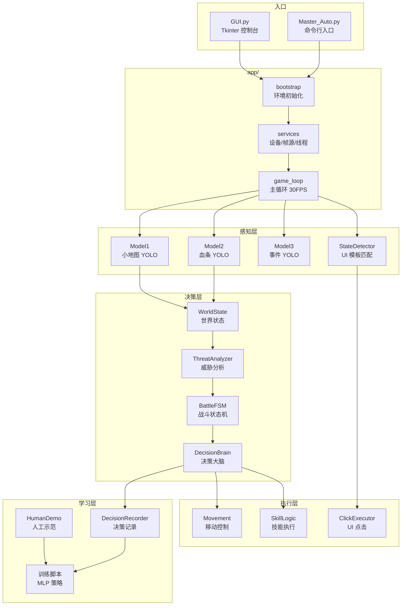
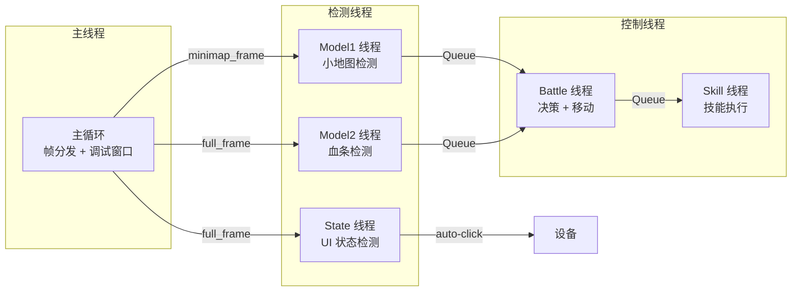

# WZ-Agent

**基于计算机视觉与策略学习的王者荣耀自动化研究平台**

> **声明**：本项目仅用于计算机视觉、自动化控制和智能体学习的学术研究。请勿在影响他人体验的环境中使用，使用前请自行确认是否符合游戏、平台和设备的相关规则。

---

## 项目简介

WZ-Agent 是一个运行在 Windows 上的王者荣耀辅助英雄自动化系统，支持 Android 真机与 MuMu 模拟器。系统通过 scrcpy/ADB 捕获游戏画面，使用三个 YOLO 模型进行实时视觉检测，结合规则引擎和可选的 PyTorch 策略模型完成辅助英雄（瑶、蔡文姬、明世隐）的全自动操控与训练数据采集。

### 核心能力

| 能力 | 说明 |
|------|------|
| **视觉检测** | 小地图英雄定位、血条识别、击杀/塔攻击事件检测（YOLO v8/v11） |
| **UI 自动化** | 25+ 种游戏界面状态识别与自动推进（大厅、匹配、选人、结算） |
| **战斗决策** | 四状态有限状态机（跟随/战斗/撤退/回城）+ 威胁分析 + 目标选择 |
| **移动控制** | A* 寻路、8 方向移动、卡住检测（7 方向避障 + 回城兜底） |
| **技能释放** | 英雄专属技能策略（瑶附身/护盾、蔡文姬治疗、明世隐增益） |
| **策略学习** | 规则决策记录 + 人工示范采集 → MLP 策略训练 + 质量门控 |
| **桌面 GUI** | Tkinter 控制台：设备管理、启停控制、日志监控、训练入口 |

---

## 系统架构



### 线程模型

系统运行时包含 **5 个并行守护线程**，由 `ThreadSupervisor` 监控和自动重启：



---

## 快速开始

### 1. 环境准备

- Windows 10/11、Python 3.11+
- ADB（系统 PATH 中或在 GUI 中指定路径）
- Android 真机开启 USB 调试，或 MuMu 模拟器开启 ADB

### 2. 安装依赖

```powershell
python -m venv .venv
.\.venv\Scripts\Activate.ps1
pip install --upgrade pip
pip install -r requirements.txt
```

可选 scrcpy 帧源（更高帧率）：

```powershell
pip install av==17.0.1
pip install scrcpy-client==0.4.1 --no-deps
```

### 3. 放置模型

将三个 YOLO 权重放入 `models/` 目录：

```
models/best_perfect.pt   # 小地图英雄检测
models/WZRY-health.pt    # 血条检测
models/wzry.pt           # 事件检测
```

### 4. 启动

**GUI 方式**（推荐）：

```powershell
python GUI.py
```

**命令行方式**：

```powershell
python Master_Auto.py
```

> 首次使用建议关闭 AI 自动操作，先观察检测效果，确认正常后再开启。

详细安装指南见 [docs/INSTALLATION.md](docs/INSTALLATION.md)。

---

## 数据采集与训练

### 自训练（规则决策记录）

运行时自动记录规则策略的决策样本到 `logs/decision_records/`：

```powershell
python scripts/train_self_policy.py logs/decision_records --output models/self_policy.pt --epochs 20
```

### 人工示范

在 GUI 中开启示范采集，数据写入 `logs/human_demos/`：

```powershell
python scripts/train_human_policy.py logs/human_demos --output models/human_policy.pt --epochs 20
```

### 质量门控

训练报告会自动检查以下指标，不合格的模型将被拒绝启用：

- 坐标越界数据
- 运行时可执行动作样本不足
- `no_op` 占比过高
- 验证宏召回率过低

详见 [docs/LEARNING.md](docs/LEARNING.md)。

---

## 项目结构

```
wzry_ai/
├── GUI.py / Master_Auto.py        # 入口（薄封装）
├── src/wzry_ai/                   # 主代码包
│   ├── app/                       #   应用编排：启动、服务、主循环
│   ├── battle/                    #   战斗系统：FSM、决策、世界状态
│   ├── detection/                 #   视觉检测：YOLO、寻路、地图
│   ├── game_manager/              #   UI 状态机：模板匹配、选英雄
│   ├── skills/                    #   技能系统：瑶/蔡文姬/明世隐
│   ├── movement/                  #   移动控制：A* 寻路、卡住检测
│   ├── learning/                  #   学习管道：示范采集、策略加载
│   ├── device/                    #   设备层：ADB、scrcpy、MuMu
│   ├── config/                    #   配置：常量、模板、按键映射
│   └── utils/                     #   工具：日志、帧管理、键盘、OCR
├── scripts/                       # CLI 启动器和训练脚本
├── models/                        # YOLO 权重 + 策略模型（不提交）
├── assets/                        # UI 模板图片、英雄素材
├── data/                          # 地图数据、英雄特征
├── logs/                          # 运行日志（不提交）
├── tests/                         # 测试套件
└── docs/                          # 详细文档
```

---

## 文档

| 文档 | 内容 |
|------|------|
| [安装与运行](docs/INSTALLATION.md) | 从零搭建开发环境和首次启动 |
| [GUI 使用说明](docs/GUI.md) | 控制台各功能模块详解 |
| [配置与环境变量](docs/CONFIGURATION.md) | 全部环境变量参考 |
| [学习与训练](docs/LEARNING.md) | 数据采集、模型训练与质量门控 |
| [架构说明](ARCHITECTURE.md) | 模块划分、数据流与扩展指南 |
| [排错指南](docs/TROUBLESHOOTING.md) | 常见问题与解决方案 |
| [贡献指南](CONTRIBUTING.md) | 代码规范与提交流程 |
| [发布检查清单](docs/RELEASE_CHECKLIST.md) | 发布前检查项 |
| [测试说明](tests/README.md) | 测试运行与编写规范 |

---

## 开发

```powershell
pip install -r requirements-dev.txt    # 安装开发依赖
python -m pytest -q                     # 运行测试
```

### 仓库约定

- `logs/`、`models/*.pt`、`.env`、`scrcpy.zip` 不提交到仓库
- 不提交个人设备序列号、日志和训练数据
- 发布前运行完整测试套件

---

## 许可证

本项目采用 [GNU General Public License v3.0](LICENSE) 发布。
