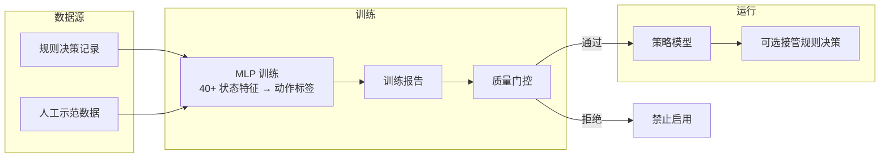

# 学习与训练

本项目使用 PyTorch MLP 进行策略学习。当前阶段是「规则智能体 + 离线策略学习」，不是端到端强化学习或 Transformer 决策器。

---

## 架构概览



---

## 动作词表

### 全部动作标签

```
no_op, stay_attached, move, cast_q, cast_e, attach_teammate,
cast_f, cast_active_item, recover, basic_attack, recall,
level_ult, level_1, level_2, buy_item, touch
```

### 运行时可执行动作（策略模型直接控制）

| 动作 | 说明 |
|------|------|
| `no_op` | 不操作 |
| `stay_attached` | 保持附身状态 |
| `cast_q` | 释放一技能 |
| `cast_e` | 释放二技能 |
| `attach_teammate` | 附身队友 |
| `cast_f` | 召唤师技能 |
| `cast_active_item` | 主动装备 |
| `recover` | 回复/治疗 |
| `basic_attack` | 普通攻击 |

`move`、`touch`、`buy_item`、升级技能等由规则侧处理，不经策略模型接管。

---

## 自训练决策记录

运行时自动将规则策略的决策样本记录为 JSONL 格式。

**记录目录**：`logs/decision_records`

**训练命令**：

```powershell
python scripts/train_self_policy.py logs/decision_records --output models/self_policy.pt --epochs 20
```

**训练行为**：

- 读取 schema v1 决策记录
- 默认跳过模型自身生成的动作（避免自我污染）
- 纳入 `control_disabled` 中有明确规则动作的样本
- 跳过 dry-run 中没有明确动作的隐式 no_op
- 输出训练报告到 `models/self_policy_report.json`

---

## 人工示范

在 GUI 中开启示范采集，系统会自动选择输入源（真机用 ADB 触摸，MuMu 用 Windows 键盘）。

**记录目录**：`logs/human_demos`

**训练命令**：

```powershell
python scripts/train_human_policy.py logs/human_demos --output models/human_policy.pt --epochs 20
```

**训练行为**：

- 读取 schema v2 人工示范记录
- `stop` 动作归一为 `no_op`
- 检查触摸坐标是否超出游戏坐标平面
- 坐标污染严重时阻止训练
- 输出训练报告到 `models/human_policy_report.json`

---

## 质量门控

GUI 和运行时都会检查训练报告。以下情况模型将被**拒绝启用**：

| 拒绝条件 | 说明 |
|----------|------|
| 坐标越界 | 人工示范录制时坐标映射错误 |
| 可执行动作样本不足 | 数据主要是 `move` 或 `touch` |
| `no_op` 占比过高 | 数据中大部分是不操作 |
| 宏召回率过低 | 模型无法识别关键动作类别 |

> 如果训练报告显示「模型不可启用」，需要继续采集数据或清理污染数据后重新训练。

---

## 数据采集建议

- 每个运行时可执行动作至少采集 **20 条以上**样本，越多越好
- 人工示范时**重点录制**：一二技能、附身、保持附身、治疗/主动装备、普通攻击
- 不要只采集移动和普通点击（这些动作不由策略模型执行）
- 自训练可先关闭 AI 自动操作跑 dry-run，获得规则选择动作但不操作设备
- 训练前检查 GUI 报告中的「样本过少」和「缺失动作」警告

---

## 技术路线

### 当前（短期）

- 规则系统作为安全底座
- MLP 学习规则策略和人工示范中的高层动作
- 质量门控防止不合格模型接管

### 中期规划

- 改进状态特征：更稳定的技能冷却、敌我位置、附身状态和目标上下文
- 拆分模型：技能策略、附身策略、撤退策略分别训练
- 增加离线评估集和回放评估

### 长期方向

- 在足够干净的轨迹数据上探索序列模型或 Transformer
- 引入行为克隆 + 离线强化学习评估
- 在安全约束下做在线微调
